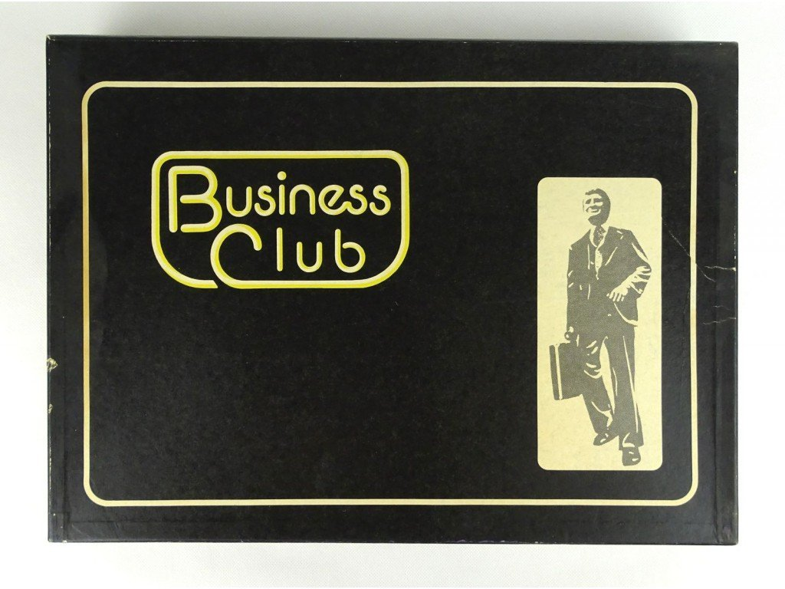

# The Business Club

> **Note:** This project is in early alpha phase.


### What is the Business Club?

Business Club is an old Hungarian board game from the 1970s.



This project is the unofficial computer version of the game that can be played online by 2-4 players.


### How to play?

The project consists of a server and a client application. The server is responsible for running the game logic and
the client is responsible for the user interface. The server can be run on a dedicated machine or on the same machine
as one of the clients. All players have to download the client application and must be connected to the same server
to play together.


#### Running the server

1. Download the latest server binary from the **releases** page.
    - The server requires a game assets file to run. This can also be downloaded from the **releases** page.
2. Run the server binary with the assets file as the first argument, e.g.:
    ```shell
    ./bc-server.linux-x86_64 game-assets-original.json
    ```

#### Running the client

1. Download the latest client binary from the **releases** page.
2. Run the client binary, e.g.:
    ```shell
    ./bc-client.linux-x86_64
    ```


### Roadmap

For the v1.0.0 release, see the [v1.0.0 milestone](https://github.com/milonoir/business-club-game/milestone/1):

Considered features for future versions:

- Sound effects
- Add support languages other than English
- Add support for game tweaks
